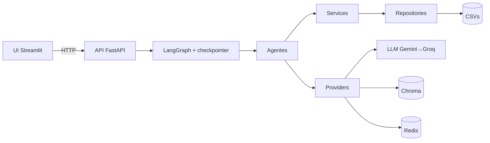
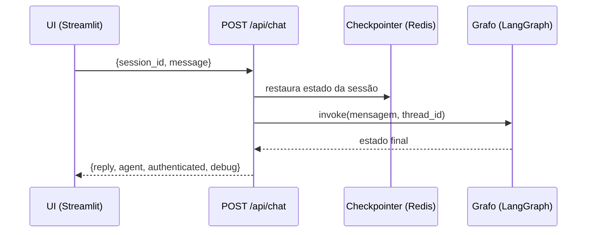
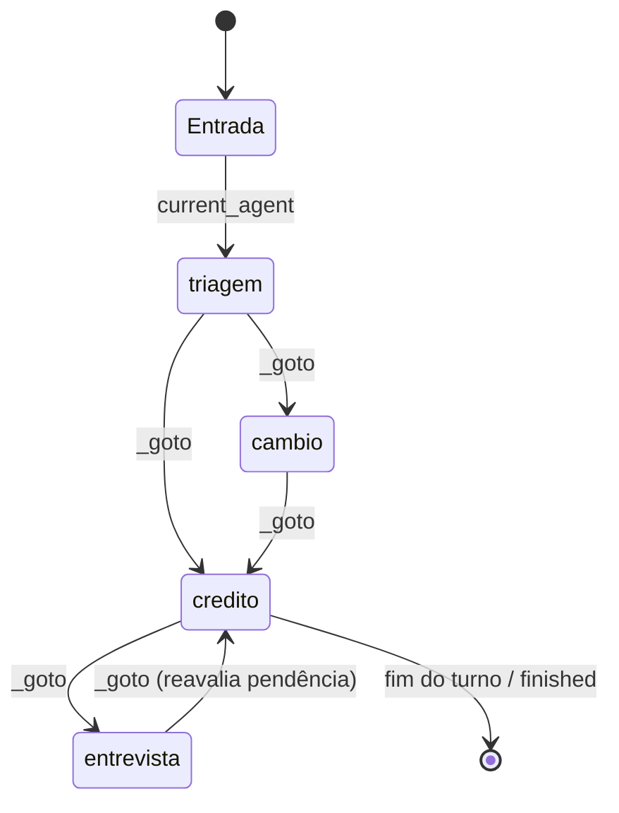

# Credibot — Agente Bancário Inteligente

Sistema de atendimento ao cliente para um banco digital fictício, com **quatro agentes de IA
especializados** orquestrados por **LangGraph** e uma **base de conhecimento (RAG)** em
**ChromaDB**. Para o cliente há um único atendente com múltiplas habilidades; internamente, os
agentes trocam de contexto de forma transparente (handoffs implícitos).

A solução é dividida em **backend (API FastAPI)** e **frontend (UI Streamlit)**: todo o chat
acontece por **requisições HTTP** à API, que mantém o estado da conversa por sessão em **Redis**.

---

## Sumário

- [Visão Geral](#visão-geral)
- [Stack e por quê](#stack-e-por-quê)
- [Arquitetura](#arquitetura)
  - [Estrutura de diretórios](#estrutura-de-diretórios)
  - [Fluxo de uma mensagem](#fluxo-de-uma-mensagem)
  - [Providers](#providers)
  - [Orquestração (LangGraph)](#orquestração-langgraph)
  - [Base de conhecimento (RAG)](#base-de-conhecimento-rag)
  - [Manipulação de dados](#manipulação-de-dados)
- [Funcionalidades](#funcionalidades)
- [Escolhas Técnicas](#escolhas-técnicas)
- [Desafios e Soluções](#desafios-e-soluções)
- [Execução](#execução)
- [Testes](#testes)

---

## Visão Geral

O atendimento começa na **Triagem**, que autentica o cliente (CPF + data de nascimento) contra
`clientes.csv` e, somente após o sucesso, direciona ao agente adequado.

| Agente | Responsabilidade |
| --- | --- |
| **Triagem** | Saudação, validação imediata de CPF, autenticação (até 3 tentativas) e roteamento. |
| **Crédito** | Consulta de limite e solicitação de aumento (registro do pedido + avaliação por score). |
| **Entrevista de Crédito** | Entrevista financeira que recalcula o score e o persiste. |
| **Câmbio** | Cotação de moedas em tempo real (AwesomeAPI). |

Qualquer agente pode consultar a **base de conhecimento (RAG)** para responder dúvidas sobre
políticas, tarifas, crédito, câmbio e segurança com informações oficiais do banco.

---

## Stack e por quê

A decisão central foi usar **LangGraph** para orquestrar os agentes. O desafio sugeria
LangGraph, CrewAI, LangChain, LlamaIndex e Google ADK — escolhi LangGraph porque o problema é,
na essência, **fluxo de estado entre agentes**, e é exatamente isso que ele modela.

- **Orquestração — LangGraph.** Cada agente vira um **nó** de um grafo de estado, e o *handoff
  invisível no mesmo turno* que o desafio pede cai naturalmente numa **aresta condicional** (o
  campo `_goto`). O estado compartilhado (histórico via `add_messages`, autenticação, agente
  atual, pendências) é cidadão de primeira classe, e o **checkpointer** dá persistência de sessão
  sem código extra. Por que não as alternativas: CrewAI/AutoGen são ótimos para "times com
  papéis", mas abstraem demais o controle de fluxo por turno; os agentes ReAct do LangChain dão
  menos controle determinístico sobre as transições; LlamaIndex brilha em RAG, não em orquestração
  multiagente com estado; Google ADK amarraria ao ecossistema Google. Para *handoffs implícitos
  com estado*, LangGraph é o encaixe mais direto.
- **LLM — Gemini (primário) → Groq (fallback).** Ambos com free tier, entre os sugeridos no
  desafio. O Gemini `flash-lite` é barato e bom em *tool calling* (essencial, já que os agentes
  agem escolhendo ferramentas); o Groq (Llama 3.3) entra como **resiliência** quando a cota do
  Gemini estoura. O `with_fallbacks` do LangChain torna a troca transparente. (OpenAI/TogetherAI/
  OpenRouter eram opções; optei por Gemini+Groq por custo zero e pela latência do Groq.)
- **Como a stack facilita construir os agentes.** O padrão **`@tool` (schema) + handler
  (execução)** separa *o que o LLM decide* de *o que o sistema faz*: a regra de negócio fica
  determinística, isolada em `services/` e **testável sem chamar LLM**; o modelo só orquestra
  linguagem e escolhe ferramentas. Com o grafo (transições) + container de DI (serviços),
  **adicionar um agente é criar um módulo no mesmo formato e registrar um nó** — sem reescrever
  o motor de turno.
- **Suporte — RAG em ChromaDB** (banco vetorial *embedded*, sem servidor extra), **sessões em
  Redis** (sobrevivem a restart), **API em FastAPI** e **UI em Streamlit** (sugerido no desafio),
  desacoplados por HTTP. **Pydantic** em todo o domínio para validação e serialização confiáveis.

---

## Arquitetura

Raiz dividida em **app / infra / tests / .github**, com o código em camadas de dependência
unidirecional (de fora para dentro: `agents` → `services` → `repositories` → `domain`, com
`core` transversal e `providers` isolando o mundo externo).

### Estrutura de diretórios

```
app/
  api/               # FastAPI: rotas /chat e /health, schemas, sessões
  src/
    core/            # config, constants, logging, utils  (infra transversal, sem negócio)
    domain/          # models, enums, results (Pydantic)  — puro, sem I/O
    repositories/    # acesso a dados (CSV -> modelos), com lock e erros controlados
    services/        # regras de negócio (auth, crédito, entrevista, câmbio, conhecimento)
    providers/       # adaptadores externos: llm, embeddings, vectorstore, checkpointer
    rag/             # documents/*.md + loader (carrega e fatia os documentos)
    agents/          # os 4 agentes: prompts, ferramentas e handlers, sobre os services
    orchestration/   # estado, grafo LangGraph e container de injeção de dependência
  ui/                # Streamlit — cliente HTTP da API (não importa `src`)
  data/              # CSVs (fonte de dados) + coleção Chroma (gerada)
  logs/              # gerado em runtime
infra/               # pyproject.toml (Poetry), Dockerfiles, docker-compose, .env
tests/  .github/     # testes e CI;  configs na raiz: pytest.ini, ruff.toml
```

Visão de componentes:



### Fluxo de uma mensagem

A UI conversa com a API por HTTP (`POST /api/chat`). O servidor mantém o **estado da conversa
por `session_id`** usando o **checkpointer do LangGraph** (`thread_id`): o cliente envia apenas
`{session_id, mensagem}` e o servidor preserva histórico, autenticação e agente atual entre as
requisições. Com Redis, as sessões **sobrevivem a um restart** da API.



Endpoints: `GET /health` e `POST /api/chat` (Swagger em `/docs`).

### Providers

Todo acoplamento com serviços externos vive em `app/src/providers/`, atrás de funções simples.
Trocar um provedor não altera `services` nem `agents`.

| Provider | Responsabilidade |
| --- | --- |
| `llm.py` | Chat model **Gemini (primário) → Groq (fallback)** via `with_fallbacks`. `max_retries=1` no Gemini para cair rápido no fallback. |
| `embeddings.py` | Embeddings do Gemini. Sem `GOOGLE_API_KEY`, devolve `None` e o **RAG é desabilitado com segurança**. |
| `vectorstore.py` | **ChromaDB** persistido em `app/data/chroma`. Cria e popula a coleção na primeira execução; reaproveita depois. |
| `checkpointer.py` | Estado das sessões: **Redis** quando há `REDIS_URL`, senão `MemorySaver`. Se o Redis cair, degrada para memória sem derrubar a API. |

### Orquestração (LangGraph)

Um **grafo de estado** com um nó por agente e um **ponto de entrada condicional** que retoma
sempre o `current_agent` (padrão: triagem). Estado compartilhado (`orchestration/state.py`):

```
messages, authenticated, cpf, cliente, current_agent,
auth_attempts, pending_increase, finished, _goto (handoff interno)
```

**Ciclo de um turno** (`agents/base.py::run_agent_turn`):

1. O agente injeta seu *system prompt* e chama o LLM com suas ferramentas.
2. Cada *tool call* é executada por um **handler**, que devolve texto ao modelo **e** aplica
   efeitos no estado (autenticar, registrar aumento, recalcular score, transferir).
3. Se o turno terminaria sem texto para o cliente (comum em modelos menores após uma *tool
   call*), o motor **força uma redação final sem ferramentas** — o cliente nunca fica sem resposta.
4. Ao final: `finished` encerra (**END**); um handoff (`_goto`) segue ao agente de destino **no
   mesmo turno** (transição invisível); caso contrário, encerra o turno e aguarda o cliente.



Os agentes acessam os serviços por um **container de injeção de dependência**
(`orchestration/container.py`), o que permite injetar repositórios temporários nos testes.

### Base de conhecimento (RAG)

Pergunta → embedding → busca por similaridade no **Chroma** → trechos → o agente redige a
resposta usando apenas esse conteúdo.

- Documentos em `app/src/rag/documents/*.md` (política de crédito, tarifas, câmbio,
  segurança/LGPD e visão geral); `rag/loader.py` carrega e fatia em *chunks* (500/80).
- A ferramenta `consultar_base_conhecimento` recupera o *top-k*; o `KnowledgeService`
  **degrada com segurança** (retorna vazio) sem chave de embeddings ou em falha de rede.

**Por que Chroma e não FAISS?** Chroma é um banco vetorial completo (coleções nomeadas,
metadados, persistência gerenciada) e continua *embedded* — sem servidor extra. FAISS é apenas
uma biblioteca de índice; a troca custou reescrever somente `providers/vectorstore.py`.

### Manipulação de dados

| Arquivo | Conteúdo |
| --- | --- |
| `clientes.csv` | Fonte da autenticação: `cpf, nome, data_nascimento, email, telefone, profissao, tipo_emprego, renda_declarada, limite_atual, score, status_conta, data_abertura`. O `score` é reescrito após a entrevista e o `limite_atual` após um aumento aprovado. |
| `score_limite.csv` | Política por faixas: `score_min, score_max, limite_maximo, taxa_juros_mensal`. Aumento aprovado quando `novo_limite ≤ limite_maximo` da faixa do score. |
| `tarifas.csv` | Cesta de serviços e tarifas. |
| `solicitacoes_aumento_limite.csv` | Gerado em runtime. Cada pedido é registrado como `pendente` e, após a checagem de score, **transiciona (na mesma linha)** para `aprovado`/`rejeitado`. Colunas: `cpf_cliente, data_hora_solicitacao (ISO 8601), limite_atual, novo_limite_solicitado, status_pedido, score_no_momento, motivo`. |
| `historico_score.csv` | Trilha de auditoria dos recálculos de score. |

---

## Funcionalidades

- **Validação imediata de CPF** (`verificar_cpf`) antes de pedir a data — um erro de digitação
  não consome tentativa de autenticação.
- **Autenticação** com normalização de CPF, dígitos verificadores, **datas em formato livre**
  (`14/05/1990`, `14 05 1990`, `14 de maio de 1990`, `14051990`) e checagem de conta ativa.
  **Até 3 tentativas**; na terceira, encerramento cordial.
- **Consulta de limite** e **solicitação de aumento**: o pedido é registrado como `pendente`,
  avaliado contra a política de score e transicionado para `aprovado`/`rejeitado`; quando
  aprovado, o novo limite é persistido.
- **Oferta de entrevista** ao rejeitar; após o recálculo do score, a solicitação anterior é
  **reavaliada automaticamente**.
- **Entrevista de crédito**: renda, tipo de emprego, despesas, dependentes e dívidas alimentam a
  fórmula ponderada do enunciado (**clamp 0–1000**), persistida em `clientes.csv` + histórico.
- **Câmbio multi-moeda** via AwesomeAPI (código ISO 4217, padrão USD → BRL).
- **RAG** com respostas fundamentadas nas políticas do banco.
- **Handoffs implícitos** entre agentes e **encerramento por ferramenta**.
- **Tratamento de erros** controlado (CSV, API externa, entrada do usuário, RAG, LLM, Redis).
- **Resiliência em camadas**: Gemini → Groq; Redis → MemorySaver; Chroma → RAG desligado. Nenhuma
  falha isolada derruba a conversa.

---

## Escolhas Técnicas

Práticas de engenharia que sustentam o projeto (o *porquê* de cada tecnologia está em
[Stack e por quê](#stack-e-por-quê)):

- **Regra de negócio separada do LLM** — toda a lógica (auth, score, crédito, câmbio) vive em
  `services/` puros e é **testada sem chamar nenhuma API**; o LLM apenas orquestra a conversa.
- **Domínio em Pydantic** — modelos, enums e *results* tipados, com validação e serialização
  confiáveis, sem estruturas soltas.
- **Sem números mágicos** — limites, pesos e cabeçalhos de CSV centralizados em `constants.py`;
  formatação de texto/moeda em `utils.py`.
- **CI (GitHub Actions)** — ruff + pytest com cobertura em Python 3.11 e 3.12 a cada push.

---

## Desafios e Soluções

| Desafio | Solução |
| --- | --- |
| Transições invisíveis entre agentes | Handoff dentro do mesmo turno: o agente de destino assume e responde, sem avisar o cliente. |
| Ciclo de vida do pedido de aumento | Registrado como `pendente` e, após a checagem de score, transicionado para `aprovado`/`rejeitado` na mesma linha do CSV. |
| Score fora da escala | Fórmula ponderada do enunciado com *clamp* em `[0, 1000]`. |
| Inconsistência do enunciado (`rejeitado` × `reprovado`) | Padronizado no enum `StatusPedido`. |
| Modelos menores encerrando o turno sem texto | Rede de segurança que força uma redação final sem ferramentas. |
| Modelo copiando instruções internas | Todo retorno de ferramenta é marcado `[interno]`; o prompt proíbe a cópia literal. |
| Cotas de free tier de LLM | Fallback automático Gemini → Groq e mensagem controlada quando ambos atingem o limite. |

---

## Execução

Requer **Python 3.11+**. As chaves ficam em `infra/.env`:

```bash
cp infra/.env.example infra/.env   # preencha GOOGLE_API_KEY e (opcional) GROQ_API_KEY
```

Uma chave já é suficiente. Com as duas, o Groq atua como fallback do Gemini. A `GOOGLE_API_KEY`
também habilita o RAG (embeddings).

### Opção A — Docker (recomendado)

Sobe três serviços: `redis`, `api` e `ui`.

```bash
docker compose -f infra/docker-compose.yml up --build
```

- UI (Streamlit): **http://localhost:8501**
- API (Swagger): **http://localhost:8000/docs**

### Opção B — Local (Poetry)

```bash
poetry -C infra install
# Terminal 1 — API (sem REDIS_URL, usa MemorySaver)
PYTHONPATH=app poetry -C infra run uvicorn api.main:app --port 8000
# Terminal 2 — UI
PYTHONPATH=app poetry -C infra run streamlit run app/ui/streamlit_app.py
```

O `pyproject.toml` mora em `infra/` com `package-mode = false`: o Poetry apenas resolve
dependências, e o código entra pelo `PYTHONPATH=app`.

### Testando a API diretamente

```bash
curl -X POST http://localhost:8000/api/chat \
  -H 'Content-Type: application/json' \
  -d '{"message":"Olá, meu CPF é 104.332.181-00"}'
# reutilize o "session_id" retornado nas próximas chamadas para manter o contexto
```

### Clientes de exemplo (`app/data/clientes.csv`)

| Nome | CPF | Nascimento | Limite | Score | Conta |
| --- | --- | --- | --- | --- | --- |
| Ana Souza | 104.332.181-00 | 14/05/1990 | 5.000 | 720 | ativa |
| Diego Rocha | 026.542.351-14 | 19/07/1995 | 800 | 250 | ativa |
| Carla Mendes | 083.863.794-99 | 27/03/1978 | 15.000 | 850 | ativa |
| Felipe Nunes | 816.184.959-50 | 08/09/1988 | 10.000 | 780 | bloqueada |

Diego demonstra o fluxo **rejeição → entrevista → aprovação**; Felipe demonstra **conta inativa**.

**Nota sobre o free tier de LLM:** os modelos Gemini gratuitos têm cota diária baixa. Ao esgotar,
o app cai para o Groq automaticamente; se ambos atingirem o limite, o atendente responde com uma
mensagem de instabilidade (erro tratado, sem quebrar a aplicação).

---

## Testes

Cobrem as regras determinísticas (CPF, datas, score, crédito, câmbio com API mockada,
repositórios, domínio e RAG) **e a orquestração completa** — grafo e API — com um **LLM falso**,
sem chamar nenhuma API externa.

```bash
poetry -C infra run pytest              # com cobertura (config em pytest.ini)
poetry -C infra run ruff check app tests
```

O mesmo conjunto roda no **CI** (`.github/workflows/ci.yml`) em Python 3.11 e 3.12.
