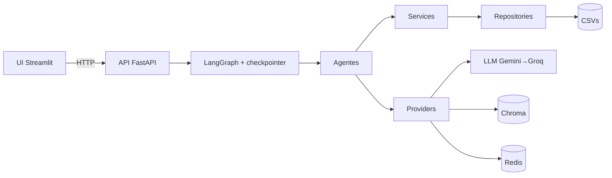
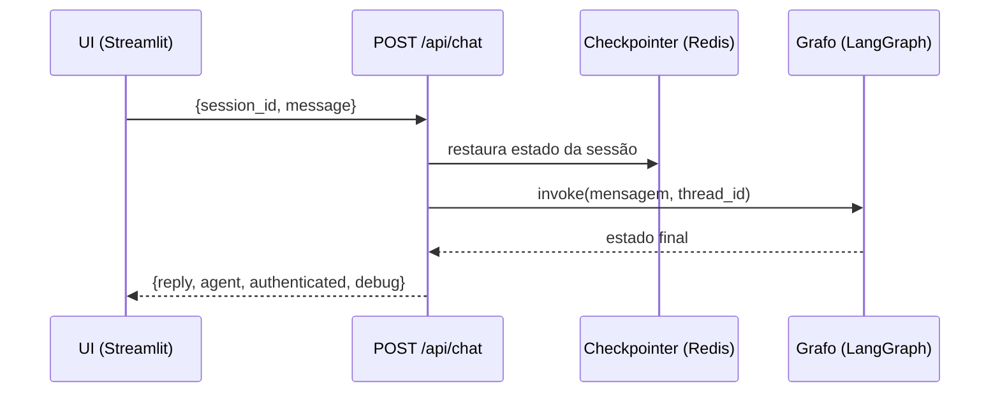
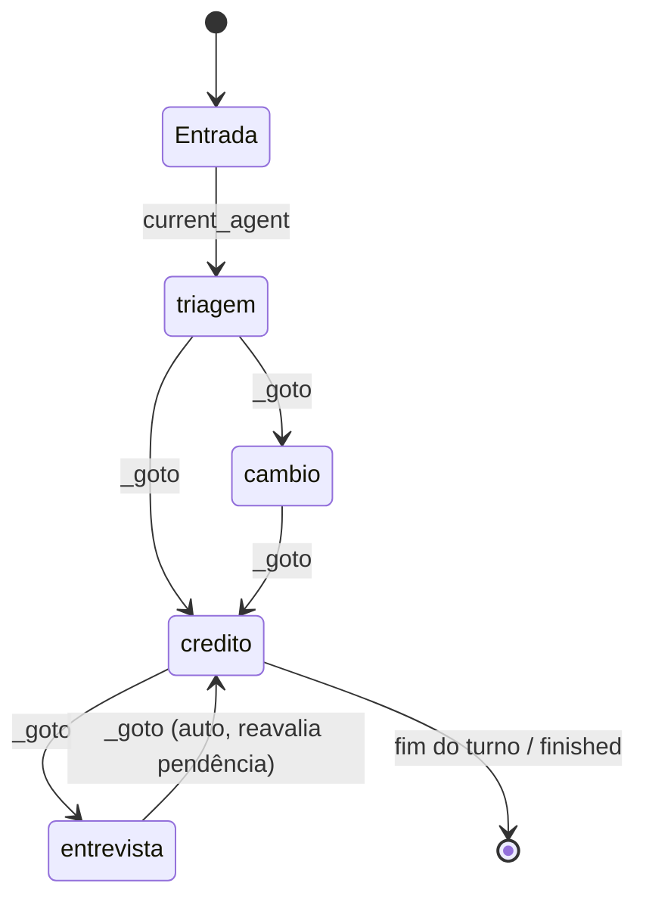

# 🏦 Banco Ágil — Agente Bancário Inteligente

Sistema de atendimento ao cliente para um banco digital fictício, com **quatro agentes de IA
especializados** orquestrados por **LangGraph** e uma **base de conhecimento (RAG)** em
**ChromaDB**. Para o cliente há um único atendente com múltiplas habilidades; internamente, os
agentes trocam de contexto de forma transparente (handoffs implícitos).

O sistema é dividido em **backend (API FastAPI)** e **frontend (UI Streamlit)**: todo o chat
acontece por **requisições HTTP** à API, que mantém o estado da conversa por sessão em **Redis**.

[](./.github/workflows/ci.yml)

---

## 📌 Visão Geral

O atendimento começa na **Triagem**, que autentica (CPF + data de nascimento) contra
`clientes.csv` e, só após o sucesso, direciona ao agente certo:

| Agente | Responsabilidade |
| --- | --- |
| 🤖 **Triagem** | Saudação, validação imediata de CPF, autenticação (até 3 tentativas) e roteamento. |
| 💳 **Crédito** | Consulta de limite e solicitação de aumento (registro + avaliação por score). |
| 🗣️ **Entrevista de Crédito** | Entrevista financeira que recalcula o score e o persiste. |
| 💱 **Câmbio** | Cotação de moedas em tempo real (AwesomeAPI). |

Qualquer agente pode consultar a **base de conhecimento (RAG)** para responder dúvidas sobre
políticas, tarifas, crédito, câmbio e segurança com informações oficiais do banco.

---

## 🏗️ Arquitetura

Raiz dividida em **app / infra / tests / .github**, com o código em camadas de dependência
unidirecional:

```
app/
  api/             # FastAPI: rotas /chat e /health, schemas, sessões
  src/
    core/            # config, constants, logging, utils  (infra transversal, sem negócio)
    domain/          # models, enums, results (Pydantic)  — puro, sem I/O
    repositories/    # acesso a dados (CSV -> modelos), com lock e erros controlados
    services/        # regras de negócio (auth, crédito, entrevista, câmbio, conhecimento)
    providers/       # adaptadores de serviços externos: llm, embeddings, vectorstore, checkpointer
    rag/             # documents/*.md + loader (carrega e fatia os documentos)
    agents/          # os 4 agentes: prompts, ferramentas e handlers, sobre os services
    orchestration/   # estado, grafo LangGraph e container de injeção de dependência
  ui/              # Streamlit — cliente HTTP da API (não importa `src`)
  data/            # CSVs (fonte de dados) + coleção Chroma (gerada)
  logs/            # gerado em runtime
infra/             # pyproject.toml (Poetry), Dockerfiles, docker-compose, .env
tests/  .github/   pytest.ini  ruff.toml  .gitignore
```



### Providers (adaptadores de serviços externos)
Tudo que fala com o mundo lá fora vive em `app/src/providers/`:

| Provider | O que faz |
| --- | --- |
| `llm.py` | Chat model **Gemini (primário) → Groq (fallback)** via `with_fallbacks`. `max_retries=1` no Gemini para cair rápido no fallback. |
| `embeddings.py` | Embeddings do Gemini. Sem `GOOGLE_API_KEY`, devolve `None` → **RAG desabilitado com segurança**. |
| `vectorstore.py` | **ChromaDB** persistido em `app/data/chroma`. Cria e popula a coleção na 1ª execução; reaproveita depois. |
| `checkpointer.py` | Estado das sessões: **Redis** quando há `REDIS_URL`, senão `MemorySaver`. Se o Redis cair, degrada para memória sem derrubar a API. |

### API e sessões
A UI conversa com a API por HTTP (`POST /api/chat`). A API mantém o **estado da conversa por
`session_id`** usando o **checkpointer do LangGraph** (`thread_id`): o cliente só envia
`{session_id, mensagem}` e o servidor preserva histórico, autenticação e agente atual entre as
requisições. Com Redis, as sessões **sobrevivem a restart** da API.

Endpoints: `GET /health`, `POST /api/chat` (Swagger em `/docs`).



### Orquestração (LangGraph)
Um **grafo de estado** com um nó por agente e um **ponto de entrada condicional** que retoma
sempre o `current_agent` (padrão: triagem). O estado compartilhado (`orchestration/state.py`):

```
messages, authenticated, cpf, cliente, current_agent,
auth_attempts, pending_increase, finished, _goto (handoff interno)
```

**Ciclo de um turno** (`agents/base.py::run_agent_turn`):
1. O agente injeta seu *system prompt* e chama o LLM com suas ferramentas.
2. Cada *tool call* é executada por um **handler**, que devolve texto ao modelo **e** aplica
   efeitos no estado (autenticar, registrar aumento, recalcular score, transferir…).
3. Se o turno terminaria sem texto para o cliente (comum em modelos menores após uma tool
   call), o motor **força uma redação final sem ferramentas** — o cliente nunca fica sem resposta.
4. Ao final: `finished` → **END**; handoff (`_goto`) → agente de destino **no mesmo turno**
   (transição invisível); caso contrário → **END do turno** (aguarda o cliente).



Os agentes acessam os serviços por um **container de DI** (`orchestration/container.py`), o que
permite injetar repositórios temporários nos testes (`set_services`).

### RAG (base de conhecimento)
Pergunta → embedding → busca por similaridade no **Chroma** → trechos → o agente redige a
resposta apenas com esse conteúdo.

- Documentos em `app/src/rag/documents/*.md` (política de crédito, tarifas, câmbio,
  segurança/LGPD, geral); `rag/loader.py` carrega e fatia em chunks (500/80).
- `providers/vectorstore.py` mantém a coleção Chroma persistida em `app/data/chroma`.
- A ferramenta `consultar_base_conhecimento` recupera o top-k; o `KnowledgeService`
  **degrada com segurança** (retorna vazio) sem chave de embeddings ou em falha de rede.

> **Por que Chroma e não FAISS?** Chroma é um banco vetorial de verdade (coleções nomeadas,
> metadados, persistência gerenciada) e continua *embedded* — sem servidor extra. FAISS é só
> uma biblioteca de índice; a troca custou reescrever apenas `providers/vectorstore.py`.

### Como os dados são manipulados
- **`clientes.csv`** — `cpf, nome, data_nascimento, email, telefone, profissao, tipo_emprego,
  renda_declarada, limite_atual, score, status_conta, data_abertura`. Fonte da autenticação;
  `score` é reescrito após a entrevista e `limite_atual` após um aumento aprovado.
- **`score_limite.csv`** — política por **faixas**: `score_min, score_max, limite_maximo,
  taxa_juros_mensal`. Aumento aprovado se `novo_limite ≤ limite_maximo` da faixa do score.
- **`tarifas.csv`** — cesta de serviços/tarifas.
- **`solicitacoes_aumento_limite.csv`** — gerado em runtime; cada pedido é apendado com
  `cpf_cliente, data_hora_solicitacao (ISO 8601), limite_atual, novo_limite_solicitado,
  status_pedido, score_no_momento, motivo`.
- **`historico_score.csv`** — trilha de auditoria dos recálculos de score.

---

## ✅ Funcionalidades

- **Validação imediata de CPF** (`verificar_cpf`) antes de pedir a data — erro de digitação não
  consome tentativa de autenticação.
- **Autenticação** com normalização de CPF, dígitos verificadores, **datas em formato livre**
  (`14/05/1990`, `14 05 1990`, `14 de maio de 1990`, `14051990`) e checagem de conta ativa.
  **Até 3 tentativas**; na 3ª, encerramento cordial.
- **Consulta de limite** e **solicitação de aumento** com registro em CSV, decisão automática e
  atualização do limite quando aprovado.
- **Oferta de entrevista** ao rejeitar; após o recálculo, a solicitação pendente é
  **reavaliada automaticamente**.
- **Entrevista de crédito**: renda, emprego, despesas, dependentes e dívidas → score
  (fórmula ponderada com **clamp 0–1000**) persistido em `clientes.csv` + histórico.
- **Câmbio multi-moeda** via AwesomeAPI, default USD→BRL.
- **RAG** com respostas fundamentadas nas políticas do banco.
- **Handoffs implícitos** e **encerramento por ferramenta**.
- **Tratamento de erros** controlado (CSV, API, entrada, RAG, LLM, Redis) com logging.
- **Resiliência**: Gemini → Groq; Redis → MemorySaver; Chroma → RAG off. Nada derruba a conversa.

---

## ⚙️ Escolhas Técnicas

- **Backend/Frontend desacoplados** — a UI é só um cliente HTTP; a lógica vive atrás da API.
- **Sessões no servidor (Redis)** — requisições leves e stateless do lado do cliente; conversas
  sobrevivem a restart e escalam com múltiplos workers.
- **Camada `providers`** — todo acoplamento externo (LLM, embeddings, vetores, Redis) fica
  isolado atrás de funções simples. Trocar Chroma por outro store, ou Gemini por outro modelo,
  não toca em `services` nem em `agents`.
- **Regras de negócio determinísticas**, separadas do LLM e testadas sem chamar API nenhuma.
- **Pydantic em todo o domínio** (modelos, enums e *results*) — validação e serialização
  confiáveis, sem `@dataclass` solto.
- **`constants.py` e `utils.py`** — zero números mágicos e zero formatação duplicada.
- **CI/CD (GitHub Actions)** — ruff + pytest com cobertura em Python 3.11 e 3.12.

---

## 🧩 Desafios e Soluções

- **Transições invisíveis** — handoff dentro do mesmo turno: o agente de destino responde.
- **Score estourando a escala** — clamp [0,1000] e teto na contribuição da renda (máximo natural
  com os pesos do enunciado é 800).
- **Inconsistência do enunciado** (`rejeitado` × `reprovado`) — padronizado no enum `StatusPedido`.
- **Modelos menores encerrando o turno sem texto** — rede de segurança que força a redação final.
- **Resposta “vazando” de turnos anteriores** — a extração de resposta é recortada ao turno atual.
- **Modelo copiando instruções internas** — todo retorno de ferramenta é marcado `[interno]` e o
  prompt proíbe cópia literal.
- **Cotas de free tier** — fallback automático e mensagem controlada quando ambos os provedores
  estouram o limite.

---

## 🚀 Execução

Requer **Python 3.11+**. As chaves ficam em `infra/.env`:

```bash
cp infra/.env.example infra/.env   # preencha GOOGLE_API_KEY e (opcional) GROQ_API_KEY
```

> Uma chave já basta. Com as duas, o Groq atua como fallback do Gemini. A `GOOGLE_API_KEY`
> também habilita o RAG (embeddings).

### Opção A — Docker (recomendado): redis + api + ui

```bash
docker compose -f infra/docker-compose.yml up --build
```

- **UI** (Streamlit): **http://localhost:8501**
- **API** (Swagger): **http://localhost:8000/docs**

### Opção B — Local (Poetry)

```bash
poetry -C infra install
# Terminal 1 — API (sem REDIS_URL, usa MemorySaver)
PYTHONPATH=app poetry -C infra run uvicorn api.main:app --port 8000
# Terminal 2 — UI
PYTHONPATH=app poetry -C infra run streamlit run app/ui/streamlit_app.py
```

> O `pyproject.toml` mora em `infra/` com `package-mode = false`: o Poetry só resolve
> dependências, e o código entra pelo `PYTHONPATH=app`.

### Testando a API direto

```bash
curl -X POST http://localhost:8000/api/chat \
  -H 'Content-Type: application/json' \
  -d '{"message":"Olá, meu CPF é 104.332.181-00"}'
# reutilize o "session_id" retornado nas próximas chamadas para manter o contexto
```

### Clientes de exemplo (`app/data/clientes.csv`)

| Nome | CPF | Nascimento | Limite | Score | Conta |
| --- | --- | --- | --- | --- | --- |
| Ana Souza | 104.332.181-00 | 14/05/1990 | 5.000 | 720 | ativa |
| Diego Rocha | 026.542.351-14 | 19/07/1995 | 800 | 250 | ativa |
| Carla Mendes | 083.863.794-99 | 27/03/1978 | 15.000 | 850 | ativa |
| Felipe Nunes | 816.184.959-50 | 08/09/1988 | 10.000 | 780 | bloqueada |

> Diego demonstra **rejeição → entrevista → aprovação**. Felipe demonstra **conta inativa**.

> ⚠️ **Free tier de LLM:** modelos Gemini gratuitos têm cota diária baixa. Ao esgotar, o app cai
> para o Groq automaticamente; se ambos estiverem no limite, o atendente responde com uma
> mensagem de instabilidade (erro tratado, não quebra).

---

## 🧪 Testes

Cobrem as regras determinísticas (CPF, datas, score, crédito, câmbio com API mockada,
repositórios, domínio, RAG) **e a orquestração completa** — grafo e API — com um **LLM falso**,
sem chamar nenhuma API externa.

```bash
poetry -C infra run pytest            # com cobertura (config em pytest.ini)
poetry -C infra run ruff check app tests
```

O mesmo roda no **CI** (`.github/workflows/ci.yml`) em Python 3.11 e 3.12.
